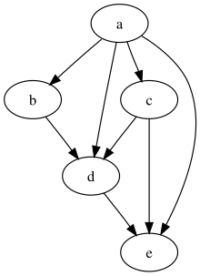

Tutorial part 1 - Dag
=====================

In this tutorial, we'll start to build a simple application to transform text.
We'll see that simple blocks can be joined together to build
a more complex application.

A "dag" is a `directed acyclic graph <https://en.wikipedia.org/wiki/Directed_acyclic_graph>`_. Each connection in the graph has a direction,
so in the graph below, node ``a`` is connected to node ``b``,
but node ``b`` is not connected to node ``a``. In addition, starting at
any given node and following connections will never lead back to the starting node.

In particular, we build a graph by connecting blocks. More precisely,
blocks are connected by connecting output params to input params.
Rather than invent a name, we call a dag made up of connected blocks
a "dag".

Out example dag will contain three blocks.

* An "external input" block to provide data to the dag;
* A text inverter block, that converts text to upper or lower case;
* A vowel inverter block, that converts vowels to upper or lower case;

We suggest that you create a new Python script file and follow along,
so you can see how blocks work, and how changes affect the dag.
If things go wrong, copies of the tutorial scripts are in the ``tutorials``
directory.

As we saw in the previous tutorial, a block is an instance of a class that
subclasses ``Block``, and uses at least one ``param`` for input and/or output.

First we'll look at the ExternalInput class. There are two parameters, defined using the param library. 
How do we know which are inputs and which are outputs? Inputs start with in_, outputs start with out_.

ExternalInput has two inputs, and two outputs: a text parameter containing text to be transformed, and a flag that changes the transformation.

.. code-block:: python

    from sier2 import Block, Dag, Connection
    import param
    import sys

    class ExternalInput(Block):
        """A block that provides data to the dag."""
        
        # input_text = param.String(label='Input Text', doc='Input Text')
        in_text = param.String(label='Input text', doc='Input text')
        in_flag = param.Boolean(label='Transform flag', doc='How text is transformed')
        
        out_text = param.String(label='Output text', doc='Output text')
        out_flag = param.Boolean(label='Transform flag', doc='How text is transformed')

        def prime(self):
            self.out_text = self.in_text
            self.out_flag = self.in_flag

(Below we'll set the values of the outputs manually from Python. In later tutorials, we'll see how to accept user input via a GUI.)

Next, we'll look at the ``InverLetters`` class. There are four parameters,
defined using the ``param`` library. How do we know which are inputs and
which are outputs? Inputs start with ``in_``, outputs start with ``out_``.

.. code-block:: python

    class InvertLetters(Block):
        """A block that transforms text.

        The text is converted to upper or lower case, depending on the flag.
        """

        # Inputs.
        #
        in_text = param.String(label='Input text', doc='Text to be transformed')
        in_flag = param.Boolean(label='Transform flag', doc='Upper case if True, else lower case.')

        # Outputs.
        #
        out_text = param.String(label='Output text', doc='Transformed text')
        out_flag = param.Boolean(label='Inverse transform flag', doc='The opposite of the input flag')

        def execute(self):
            print(f'in execute: {self.in_flag=} {self.in_text=}')
            text = self.in_text.upper() if self.in_flag else self.in_text.lower()

            self.out_text = text
            self.out_flag = not self.in_flag

``InvertLetters`` has two inputs, and two outputs: a ``in_text`` parameter
containing text to be transformed, a ``in_flag`` parameter that changes the transformation, 
a ``out_text`` parameter that stores the converted text, and a ``out_flag`` that stores the inverse 
of the ``in_flag``.

.. note:: 
    (For convenience, ``execute()`` prints its input params so we can see what the input
    param values are.)

The ``InvertVowels`` class also has two input params, but only one output param.
It also has an ``execute()`` method.

.. code-block:: python

    class InvertVowels(Block):
        """A block that inverts the case of vowels."""

        in_text = param.String(label='Input text', doc='Text that will have its vowels mangled')
        in_flag = param.Boolean(label='Transform flag', doc='Upper case if True, else lower case.')
        out_text = param.String(label='Output text', doc='Transformed text')

        def execute(self):
            t = UPPER_VOWELS if self.in_flag else LOWER_VOWELS
            self.out_text = self.in_text.translate(t)

The ``main()`` function creates an instance of each blocks, then creates a ``Dag`` and
connects the two blocks. The ``Dag.connect()`` method connects source blocks
to destination blocks. The ``Connection()`` arguments indicate
how the blocks are connected.

.. code-block:: python

    external_input = ExternalInput()
    invert_letters = InvertLetters()
    invert_vowels = InvertVowels()

    dag = Dag(doc='Transform', title='tutorial_1a')
    dag.connect(external_input, invert_letters, Connection('out_text', 'in_text'), Connection('out_flag', 'in_flag'))
    dag.connect(invert_letters, invert_vowels, Connection('out_text', 'in_text'), Connection('out_flag', 'in_flag'))

Similar connections are used to connect the ``invert_letters`` and ``invert_vowels`` blocks.

Now we can try running the dag. This where we find out why we need an
external input block.

For a dag to execute, at least one output param must be set in a block. Our ExternalInput block,
when primed, will take the inputs to ``in_text`` and ``in_flag`` and assign them to 
the block outputs ``out_text`` and ``out_flag``. 

.. code-block:: python

    external_input.in_text = 'Hello world.'
    external_input.in_flag = flag

    external_input.prime()
    
    dag.execute()

    print(f'{invert_vowels.out_text=}')

We need to prime the dag with some data (hence we can call "``ExternalInput``
a "primer" block). To do this, we assign values to the input params of ``external_input``,
and call ``external_input.prime()``. Finally, we call ``dag.execute()`` to run the 
rest of the dag and see the outputs.

To run ``tutorial_1a.py``, provide an extra argument, either ``L`` or ``U``,
to demonstrate what effect tha flag has.

The output resulting from this dag when ``L`` is passed is:

.. code-block:: text

    invert_vowels.out_text='hEllo worlD.'

.. note::

    To see this dag in action, run ``tutorials/tutorial_1a.py``.