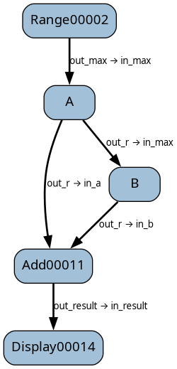

Tutorial part 7 - multiple connections
======================================

Previously, we saw what causes blocks to be executed.
In this tutorial, we look at a consequence of multiple connections.

This is a dag that generates two random numbers and adds them. The initial block passes
a maximum value to a random number generator, which passes a random number to the add block
and the maximum number to another random number generator, which also passes a random number
to the add block. (Some print() calls have been added to show what is happening.)

.. literalinclude:: /../../tutorials/tutorial_7a.py
   :language: python
   :linenos:

(There are two "Add" blocks defined here. We start by using the `Add` block.)

Running this dag:

.. code-block:: text

    $  python .\tutorial_7a.py
    Random A = 10
    Adding:
    self.in_a=10
    self.in_b=0
    Random B = 9

    + Result is 10

    Adding:
    self.in_a=10
    self.in_b=9

    + Result is 19

Random block A executes with result 9, adding the add block (using block `Add1`) and
random block B to the dag's internal run queue. However, the add block has
two `in_` params, `in_a` and `in_b`, so when it runs, only `in_a` has been set,
leaving `in_b` at its default value of 0.

Regardless, the add block (using block `Add1`) causes the display block to be added to the queue.

Then random block B runs (adding the add block to the queue again), then the display block runs.
FInally, the add block runs again, then the display block again.

What this demonstrates is that if a block has multiple inputs coming from different blocks,
the inputs will not necessarily be all set when the block is called. They might be, but nothing
says they have to be.

This is definitely not what we want, so how do we work around this? For this simple example,
we could change the dag, but that might not be workable for more complex dags.

To avoid doing unnecessary work, the add block can use default param values,
and when executed, check its params to see if they have the default values.

Change the line:

.. code-block:: python

    add = Add()

to

.. code-block:: python

    add = AddWithCheck()

The output is now:

.. code-block:: text

    $ python .\tutorial_7a.py
    Random A = 4
    Random B = 1
    Adding:
    self.in_a=4
    self.in_b=1

    + Result is 5

This is what we'd expect.
