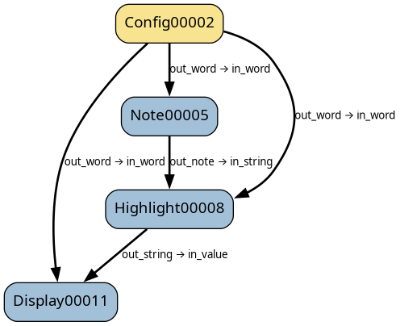

Tutorial part 8 - config pattern
================================

Previously, we saw what causes blocks to be executed.
In this tutorial, we'll discover that connecting params is not always desirable.

We'll build a dag that requires a configuration. In real life, a configuration may
contain all kinds of data, but we'll just use a word. The dag will consist of blocks
that wrap the word in a sentence, highlight the word in a sentence, and display the result.

Each block has a connection from the config block, because they each need to know the original word.

.. literalinclude:: /../../tutorials/tutorial_8a.py
   :language: python
   :linenos:

Running this dag:

.. code-block:: text

    $ python .\tutorial_7a.py palimpsest
    DISPLAY: NO-VALUE (from palimpsest)
    DISPLAY: The word of the day is "PALIMPSEST". (from palimpsest)

The display block has been executed twice!

This happens because the display block is at the end of two connections: one from the
config block, and one from the highlight block. Setting ``out_word`` in the config block
causes the display block to execute next, using the default value of ``in_value``,
because the highlight block hasn't run yet. Then the note and highlight blocks run,
and finally the display block runs againm this time with the correct ``in_value``
from the highlight block.

Furthermore, consider what would happen if the connection from config to highlight was made first.
The default value for ``in_string`` is ``None``, so the replace would raise an exception.

.. code-block:: python

        self.out_string = self.in_string.replace(self.in_word, highlight)
                          ^^^^^^^^^^^^^^^^^^^^^^
        AttributeError: 'NoneType' object has no attribute 'replace'

We're using connections to pass around a configuration parameter. This introduces a problem:
setting ``config.out_word`` unnecessarily causes connected block to be run. We could avoid this
by passing the config from block to block, but then every block between ``config`` and ``display``
would have to pass the the config along to the next block.
