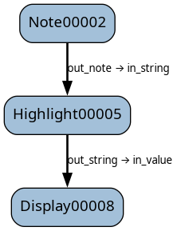

Tutorial part 9 - solving the config problem
============================================

In the previous tutorial, we discovered that passing a config block around is
a bit of a pain. In this tutorial, we salve the pain.

Instead, because a ``Block`` is a normal Python class, we can pass the config as a parameter
when we create the blocks.

.. literalinclude:: /../../tutorials/tutorial_9a.py
   :language: python
   :linenos:

.. image:: t9a.png
    :align: center

Now we have a nice linear dag where the config is being passed to each block as a
standard Python parameter. When the dag executes:

.. code-block:: text

    $ python .\tutorial_9a.py palimpsest
    DISPLAY: The word of the day is "PALIMPSEST". (from palimpsest)

Note that the ``Note`` block still requires an input connection to be part of the dag,
so it still has an ``in_word`` param. In ``execute()``, though, it could use either
``self.in_word`` or ``self.config.out_word``.

Using a config block like this is suitable if user input is required. However, not
all apps require this: they might need a database connection config, an https
session, or some other data that the user doesn't neeed to know about. In this case,
we can make the dag a bit simpler.

Instead of putting the config block in the dag, we can put it in the bag.
Blocks in the bag are executed before the dag is executed, and are not visible
in the GUI.

.. literalinclude:: /../../tutorials/tutorial_9b.py
   :language: python
   :linenos:

Now the ``Note`` block is consistent with the other blocks - it does not need
to have a config passed as an ``in_`` param.

The config does not even need to be a block. Create a config using
whatever Python data structure you like - here we use a dictionary - and
pass it to each block as it is created. This can be useful if you need to
perform actions outside of the dag before executing it.

.. literalinclude:: /../../tutorials/tutorial_9b.py
   :language: python
   :linenos:

